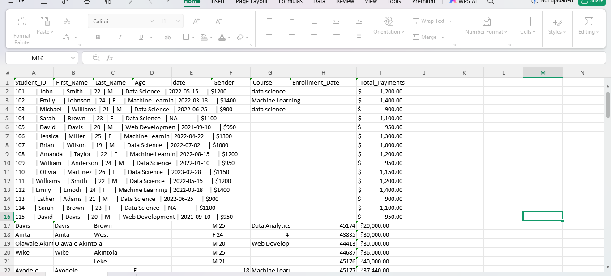
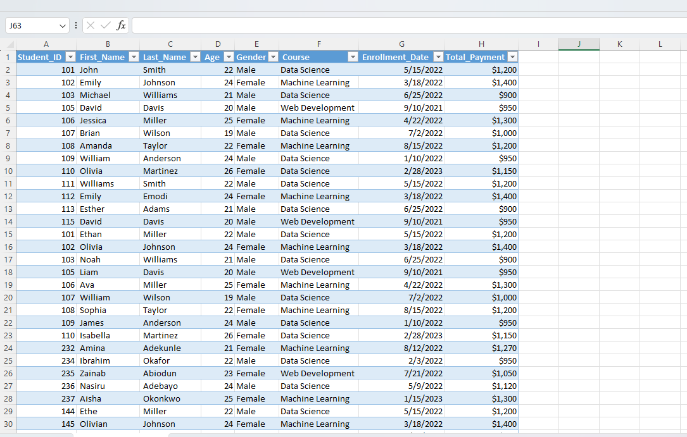

# 🎓 Student Enrollment Data Cleaning & Analysis Project (Excel)

This project takes a messy student enrollment spreadsheet and transforms it into a clean, structured, analysis-ready dataset. The data covers students enrolled in tech courses (Data Science, Machine Learning, Web Development), along with their demographics, enrollment dates, and total payments.

Instead of working with inconsistent text, misaligned columns, and duplicate records, stakeholders now have a single reliable table they can filter, sort, and analyze with confidence.

---

## 📌 Project Overview

Training programs and academies collect student records from many sources, such as registration forms, payment records, and manual entries. When this data is combined without standards, it ends up full of formatting errors, missing values, and duplicates that make analysis unreliable.

This project was developed to:

- 🧹 **Clean messy data:** fix pipe-delimited cells, misaligned columns, and inconsistent text
- 📊 **Standardize formats:** consistent course names, gender labels, dates, and payment values
- 🔁 **Remove duplicates:** eliminate repeated student records
- 📈 **Enable analysis:** produce a clean table ready for revenue, enrollment, and demographic insights

The result supports data-driven decisions on course offerings, pricing, and student recruitment.

---

## 🎯 Business Problem

Program managers need clear answers to key questions:

- Which courses attract the most students?
- How much revenue does each course generate?
- What is the age and gender profile of enrolled students?
- How has enrollment changed over time?

Without clean data, these answers stay buried in inconsistent records.

This project solves the problem by consolidating the raw records into one standardized dataset.

---

## 📂 Dataset

*(Fill in with your actual dataset details. Example structure below.)*

- **Dataset Scope:** Student enrollment and payment records for tech courses
- **Time Period:** [e.g., 2021–2023]
- **Total Records (Raw):** [number]
- **Total Records (Cleaned):** [number]
- **Key Fields:** Student_ID, First_Name, Last_Name, Age, Gender, Course, Enrollment_Date, Total_Payment

---

## 📋 Cleaned Dataset Schema

| Column | Type | Description |
|--------|------|-------------|
| `Student_ID` | Integer | Identifier for the student |
| `First_Name` | Text | Student's first name |
| `Last_Name` | Text | Student's last name |
| `Age` | Integer | Student's age in years |
| `Gender` | Text | Male / Female |
| `Course` | Text | Data Science, Machine Learning, or Web Development |
| `Enrollment_Date` | Date | Date the student enrolled |
| `Total_Payment` | Currency | Total amount paid by the student |

---

## 📈 Key Metrics and KPIs

*(Fill in with your actual figures once calculated.)*

- **Total Students Enrolled:** [number]
- **Total Revenue:** [amount]
- **Average Payment per Student:** [amount]
- **Most Popular Course:** [course]

---

## 🧹 Data Cleaning & Preparation

### Problems Found in the Raw Data

- **Pipe-delimited text:** several rows had every field crammed into one cell, separated by `|` (e.g. `101 | John | Smith | 22 | M | ...`)
- **Misaligned columns:** an extra `date` column in the header, and values sitting under the wrong headings (e.g. `M 25` combined in one cell, or age in the Course column)
- **Inconsistent course names:** `data science` vs `Data Science`, truncated values like `Machine Learnin`, and `Data Analytics`
- **Inconsistent gender coding:** `M` / `F` instead of `Male` / `Female`
- **Missing or invalid values:** `NA` in date fields, blank names and courses
- **Mixed date formats:** text dates (`2022-05-15`) alongside Excel serial numbers (e.g. `45174`)
- **Mixed payment formats:** text with `$` (`$1200`), a corrupted currency symbol (`?20,000.00`), and formatted numbers
- **Duplicate records:** the same students appearing more than once (e.g. IDs 101, 102, 103, 105)
- **Duplicated name fields:** first and last names repeated across columns (e.g. `Davis | Davis | Brown`)

### Cleaning Steps Applied

1. Split pipe-delimited text into separate columns (Text to Columns)
2. Trimmed whitespace and removed the stray `date` column
3. Realigned misplaced values to the correct columns
4. Standardized course names to a fixed set of values
5. Expanded `M` / `F` to `Male` / `Female`
6. Converted dates (including Excel serial numbers) to a proper date format
7. Converted payment values to numeric currency and removed stray symbols
8. Handled missing values (`NA`, blanks) by filling where possible or removing incomplete rows
9. Removed duplicate records
10. Applied a table style with header filters for easy sorting and filtering

---

## 🛠️ Build Process (Before & After)

### Raw Data (Before)

The original sheet with pipe-delimited cells, misaligned columns, mixed date and payment formats, and missing values.

### Cleaned Data (After)

The final table with eight consistent columns, proper data types, a table style, and header filters.

---

## 📊 Workbook Structure

### Sheet 1: Raw Data

- 🎯 **Purpose:** "What the data looked like when it arrived"
- 📌 **Contains:** original records with formatting and consistency problems

### Sheet 2: Cleaned Data

- 🎯 **Purpose:** "What the data looks like after cleaning"
- 📌 **Contains:** standardized, deduplicated, analysis-ready records

---

## 💡 Key Insights & Business Question Analysis

*(Fill in with 2–4 sentences per question once your analysis is finished.)*

**Which courses attract the most students?**

[Insight here]

**How much revenue does each course generate?**

[Insight here]

**What is the age and gender profile of students?**

[Insight here]

**How has enrollment changed over time?**

[Insight here]

---

## ⚠️ Known Issues & Notes

- **Corrupted currency symbol:** some raw rows showed `?` before payment amounts. Confirm the intended currency before financial analysis, since the cleaned sheet displays payments in `$`.
- **Repeated Student IDs:** IDs such as 101, 102, and 103 appear for different people in the cleaned sheet. Verify whether these are true duplicates or ID collisions before using `Student_ID` as a unique key.
- **Incomplete rows:** records with missing key fields were completed from context or excluded. Review these if exact counts matter.

---

## 🚀 Strategic Recommendations

*(Example structure. Tailor to your actual findings.)*

**🔑 Enforce Unique Student IDs**

Assign IDs automatically at registration to prevent duplicates and collisions.

**📝 Use Dropdowns for Data Entry**

Restrict Course and Gender fields to fixed lists so names and labels stay consistent.

**📅 Standardize Date and Payment Formats**

Use a single date format and numeric currency fields at the point of data capture.

**📊 Track Revenue by Course**

Use the cleaned data to guide pricing, marketing, and course planning.

---

## 🔚 Conclusion

This project turns a messy student enrollment spreadsheet into a reliable, structured dataset. Instead of wrestling with inconsistent text, misaligned columns, and duplicates, stakeholders can now filter, sort, and analyze student data with confidence, enabling smarter decisions on courses, pricing, and recruitment.

---

## ✨ Key Features

- ✅ Consistent course names and gender labels
- ✅ Proper date and currency formats
- ✅ Duplicate records removed
- ✅ Filterable table with header filters and table styling
- ✅ Documented cleaning process and known issues

---

## 📁 Files Included

| File | Description |
|------|-------------|
| `Data_cleaning.xlsx` | Excel workbook with raw and cleaned sheets |
| `raw_data.png` | Screenshot of the raw data |
| `cleaned_data.png` | Screenshot of the cleaned data |
| `README.md` | Project documentation |

---

## 🔧 How to Download and Use

1. Download `[your-workbook].xlsx`.
2. Open the file in Microsoft Excel or WPS Spreadsheet.
3. Go to the cleaned sheet and use the header filters to explore data by course, gender, age, or date.

---

## 🛠️ Tools and Skills

- Microsoft Excel / WPS Spreadsheet
- Data cleaning
- Text to Columns
- Data standardization
- Data analysis
